# 🧭 OpenServ Referrals System Flow

## 🎯 System Overview

```mermaid
graph TB
    %% Users
    User1[👤 User A<br/>Wants to earn rewards]
    User2[👤 User B<br/>Friend of User A]
    
    %% Central Bot
    CentralBot[🤖 @openserv_referrals_bot<br/>Central Referral Management]
    
    %% App Bot
    AppBot[🤖 Your App Bot<br/>With OpenServ SDK]
    
    %% OpenServ System
    OpenServAPI[🌐 OpenServ API<br/>referrals.openserv.ai]
    Dashboard[📊 Dashboard<br/>Analytics & Rewards]
    
    %% Flow Steps
    User1 -->|1. /listapps| CentralBot
    CentralBot -->|2. Shows available apps| User1
    User1 -->|3. /getcodefor 1| CentralBot
    CentralBot -->|4. Generates referral link| User1
    
    User1 -->|5. Shares link| User2
    User2 -->|6. Clicks referral link| AppBot
    
    AppBot -->|7. /start REFERRAL_CODE<br/>Auto-handled by SDK| OpenServAPI
    OpenServAPI -->|8. Records referral| Dashboard
    
    User2 -->|9. /buy 10| AppBot
    AppBot -->|10. ack() call<br/>Manual tracking| OpenServAPI
    OpenServAPI -->|11. Records purchase| Dashboard
    
    Dashboard -->|12. Shows rewards| User1
    Dashboard -->|13. Export for payments| Admin
    
    %% Styling
    classDef user fill:#e1f5fe,stroke:#01579b,stroke-width:2px
    classDef bot fill:#f3e5f5,stroke:#4a148c,stroke-width:2px
    classDef system fill:#e8f5e8,stroke:#1b5e20,stroke-width:2px
    
    class User1,User2 user
    class CentralBot,AppBot bot
    class OpenServAPI,Dashboard system
```

## 🔄 Detailed Flow


## 🏗️ Architecture Components

```mermaid
graph LR
    subgraph "User Layer"
        U1[👤 Referrer<br/>User A]
        U2[👤 Referred<br/>User B]
    end
    
    subgraph "Bot Layer"
        CB[🤖 Central Bot<br/>@openserv_referrals_bot]
        AB[🤖 App Bot<br/>Your Bot + SDK]
    end
    
    subgraph "API Layer"
        API[🌐 OpenServ API<br/>referrals.openserv.ai]
    end
    
    subgraph "Data Layer"
        DB[(📊 Database<br/>Referrals & Rewards)]
        DS[📈 Dashboard<br/>Analytics]
    end
    
    U1 --> CB
    U2 --> AB
    CB --> API
    AB --> API
    API --> DB
    DB --> DS
```



## 💰 Reward Flow

```mermaid
graph TD
    Start[🚀 User starts with referral] --> Reward1[$2 Reward<br/>for signup]
    Purchase[🛒 User makes purchase] --> Reward2[$5 Reward<br/>for purchase]
    
    Reward1 --> Wallet[💰 User's Wallet<br/>Set via /setwallet]
    Reward2 --> Wallet
    
    Wallet --> Export[📊 CSV Export<br/>for BULKSENDER.APP]
    Export --> Payment[💸 Bulk Payment<br/>Processing]
    
    style Start fill:#e8f5e8
    style Purchase fill:#e8f5e8
    style Reward1 fill:#fff3e0
    style Reward2 fill:#fff3e0
    style Wallet fill:#f3e5f5
    style Export fill:#e1f5fe
    style Payment fill:#e8f5e8
```



## 🔧 SDK Integration

```mermaid
graph TB
    subgraph "Your Bot Code"
        Init[Initialize Bot]
        Register[await register(bot)]
        Purchase[await ack({...})]
    end
    
    subgraph "SDK Magic"
        AutoStart[Auto-handles /start <code>]
        API[API Integration]
        Error[Error Handling]
    end
    
    subgraph "What You Get"
        Referral[Referral Tracking]
        Rewards[Reward Management]
        Analytics[Analytics Dashboard]
    end
    
    Init --> Register
    Register --> AutoStart
    Purchase --> API
    AutoStart --> Referral
    API --> Rewards
    Rewards --> Analytics
```

## 🎯 Key Mental Model Points

1. **Two Bots**: Central bot for referral management, app bot for your functionality
2. **Automatic Tracking**: SDK handles referral codes automatically
3. **Manual Actions**: You call `ack()` for purchases/achievements
4. **Central Dashboard**: All analytics and rewards in one place
5. **Simple Integration**: Just `register(bot)` + `ack()` calls

This diagram shows the complete flow from referral link generation to reward payout, making it easy to explain the system during your workshop! 